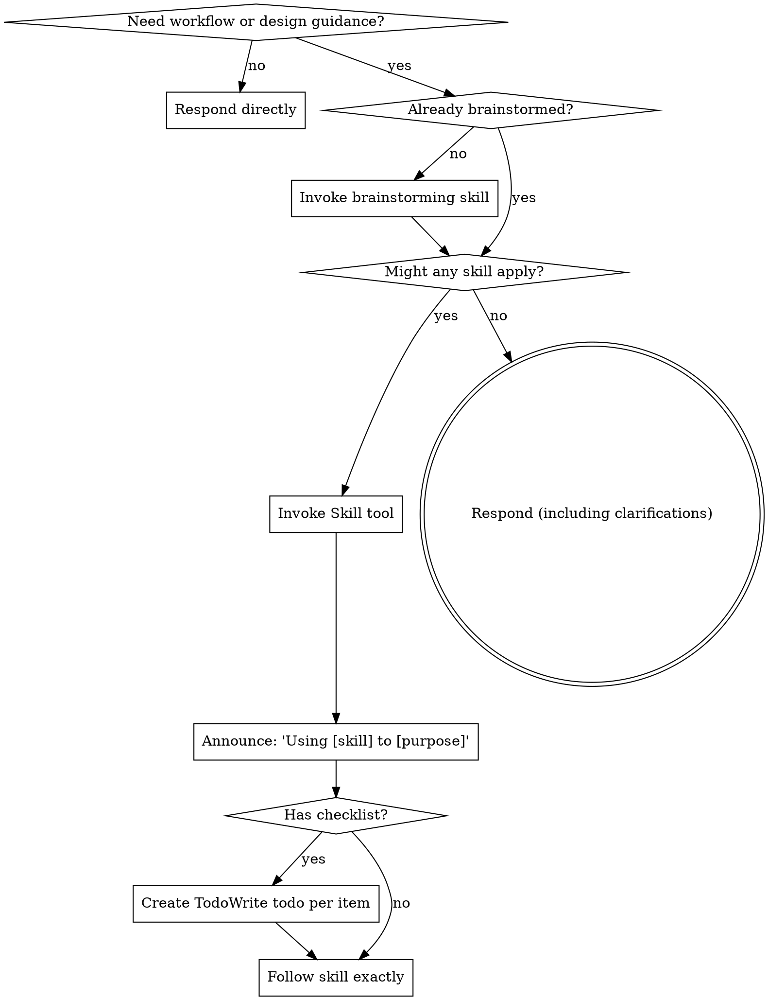

<SUBAGENT-STOP>
If you were dispatched as a subagent to execute a specific task, skip this skill.
</SUBAGENT-STOP>

<EXTREMELY-IMPORTANT>
If the task is about design direction, implementation planning, workflow choice, or shaping a solution, you MUST check whether a skill applies before proceeding.

IF A SKILL APPLIES TO THAT WORK, YOU DO NOT HAVE A CHOICE. YOU MUST USE IT.

This is not negotiable. This is not optional. You cannot rationalize your way out of this.
</EXTREMELY-IMPORTANT>

## Instruction Priority

Superpowers skills override default system prompt behavior, but **user instructions always take precedence**:

1. **User's explicit instructions** (CLAUDE.md, GEMINI.md, AGENTS.md, direct requests) — highest priority
2. **Superpowers skills** — override default system behavior where they conflict
3. **Default system prompt** — lowest priority

If CLAUDE.md, GEMINI.md, or AGENTS.md says "don't use TDD" and a skill says "always use TDD," follow the user's instructions. The user is in control.

## How to Access Skills

**In Claude Code:** Use the `Skill` tool. When you invoke a skill, its content is loaded and presented to you—follow it directly. Never use the Read tool on skill files.

**In Gemini CLI:** Skills activate via the `activate_skill` tool. If this skill activates and you need tool-name translation, read `references/gemini-tools.md`.

**In other environments:** Check your platform's documentation for how skills are loaded.

## Platform Adaptation

Skills use Claude Code tool names. Non-CC platforms: see `references/codex-tools.md` (Codex) for tool equivalents.

# Using Skills

## When to Use

Use this skill when the task is about choosing or sequencing workflow skills, including:

- Design discussions and architecture tradeoffs
- Producing a solution approach before implementation
- Writing specs, plans, or execution workflows
- Deciding whether brainstorming, debugging, TDD, review, or delegation skills should drive the task

Do not use this skill for:

- Greetings and casual chat
- Simple factual answers
- Translation
- Summarization of user-provided text
- Single-step operational requests that do not need workflow selection

## The Rule

**Invoke relevant or requested skills before substantive design, planning, or solution-shaping work.** If an invoked skill turns out to be wrong for the situation, you don't need to use it. For greetings, casual chat, and other lightweight requests, respond directly unless a skill is explicitly requested or clearly needed.

## Red Flags

These thoughts mean STOP—you're rationalizing:

| Thought | Reality |
|---------|---------|
| "This design task is simple enough to wing it" | Lightweight tasks can skip this skill. Design and planning tasks should not. |
| "I need more context before choosing a workflow" | Workflow choice is part of the work. Check skills before freehanding a plan. |
| "Let me explore the codebase first" | If exploration is part of a design or planning workflow, the skill should shape how you do it. |
| "I can answer this planning question directly" | Planning and solution questions benefit from the right process skill. |
| "This doesn't need a formal skill" | If a skill exists, use it. |
| "I remember this skill" | Skills evolve. Read current version. |
| "This doesn't count as a task" | Action = task. Check for skills. |
| "The skill is overkill" | If the task is genuinely lightweight, answer directly. If it shapes design or execution, use the skill. |
| "I'll just sketch a solution first" | For solution work, check the process before producing the answer. |
| "This feels productive" | Undisciplined action wastes time. Skills prevent this. |
| "I know what that means" | Knowing the concept ≠ using the skill. Invoke it. |

## Skill Priority

When multiple skills could apply, use this order:

1. **Process skills first** (brainstorming, debugging) - these determine HOW to approach the task
2. **Implementation skills second** (frontend-design, mcp-builder) - these guide execution

"Let's build X" → brainstorming first, then implementation skills.
"Fix this bug" → debugging first, then domain-specific skills.

## Skill Types

**Rigid** (TDD, debugging): Follow exactly. Don't adapt away discipline.

**Flexible** (patterns): Adapt principles to context.

The skill itself tells you which.

## User Instructions

Instructions say WHAT, not HOW. "Add X" or "Fix Y" doesn't mean skip workflows.
